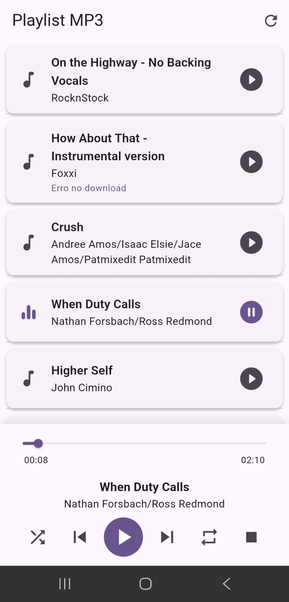

# Playlist MP3 App
### Matías Andrés Ramírez Porto, María Cecilia Vargas Dutra, Luis Felipe Castillo Pereira

Aplicativo Flutter para reprodução de músicas MP3 com downloads em segundo plano.

## Funcionalidades

### Player de Áudio
- Reproduzir, pausar, parar e navegar entre faixas
- Barra de progresso para avançar ou retroceder na música
- Exibição de título, artista e duração da faixa
- Reprodução em segundo plano
- Notificações de controle de mídia

### Modos de Reprodução
- Modo aleatório (shuffle)
- Repetição: desativada, uma faixa ou todas as faixas

### Downloads
- Download automático de todas as músicas da playlist
- Progresso de download visível por faixa
- Downloads continuam com o app fechado
- Retomada automática de downloads interrompidos

### Easter Egg
- Adiciona faixa especial quando o usuário está a menos de 50 metros do campus
- Verificação automática de localização a cada 30 segundos

### Interface
- Lista de músicas com pull-to-refresh
- Indicadores de estado por faixa: reproduzindo, pausado, baixando, baixado, erro
- Mensagens de erro amigáveis
- Suporte a leitores de tela



## Dependências Principais
- just_audio
- audio_service
- dio
- geolocator
- workmanager
- hive
- provider

## Requisitos
- Flutter 3.5.0+
- Android 5.0+ (API 21)

## Execução
```bash
flutter pub get
flutter run
```

## Build
```bash
flutter build apk --release
```